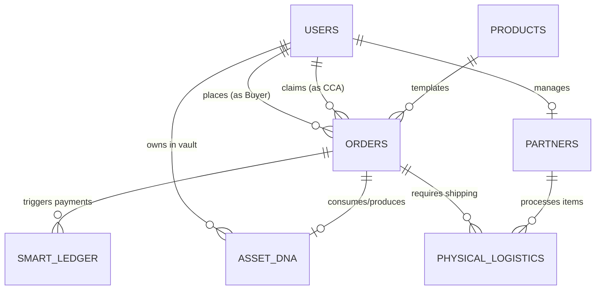

> **Status:** current canonical as at dormancy (2026-04-19). Pre-repository planning text, not yet verified against the code by the Architect. Source: `vivid/docs/Database_Schema_Blueprint.md`. 

# VIVID Database Schema Blueprint (Phase 1)

This blueprint translates the VIVID Master Specifications (Business Logic, Catalog, Sagas, Partner Ecosystem, and UX/Gamification) into a strict Supabase PostgreSQL schema plan.

## 1. Core Enums

To enforce strict state machine logic and standardize categories, we will use PostgreSQL `ENUM` types:

*   **`order_status`**: Tracks the 6-Meter System flows.
    *   *Negotiation limits:* `draft`, `offer_req`, `offer_req_without_pay`, `claimable`, `claimed`, `offer_sent`, `counter_offer_received`, `offer_rejected`, `awaiting_pay`, `parting_requested`, `partially_pay`, `paid`
    *   *Production limits:* `in_progress`, `action_req`, `prod_ready`
    *   *Review & QA limits:* `delivered`, `disputed`, `redo_progress`, `refunded`, `completed`
    *   *Exception limits:* `archived_abandoned`, `offer_restored`, `paused_insufficient_funds`
*   **`wallet_types`**: Used in the Smart Ledger double-entry system.
    *   `user_wallet`, `escrow_pool`, `cca_pending`, `cca_available`, `platform_rev`, `payout_stripe`
*   **`transaction_status`**: Tracks ledger states.
    *   `HELD`, `PENDING`, `CLEARED`, `PAID`, `VOID`
*   **`user_role`**: Maps to `<Clerk JWT publicMetadata.role>`.
    *   `user`, `cca`, `partner`, `admin`
*   **`logistics_status`**: Tracks physical asset states.
    *   `awaiting_shipment`, `in_transit_inbound`, `physical_received`, `processing_digital`, `in_transit_outbound`, `items_returned`

## 2. Core Entities (Tables)

### `users`
*   `id` (UUID, PK) - Maps to Clerk UserID
*   `role` (Enum: `user_role`) - Default 'user'
*   `credit_balance` (Numeric) - For tracking virtual credits
*   `preservation_score` (Integer) - Gamification metric (0-100)
*   `created_at`, `updated_at`

### `products`
*   `id` (UUID, PK)
*   `name`, `description` (Text)
*   `product_type` (Enum: generic, collection, saga, automated_creation)
*   `base_price_cents` (Integer)
*   `is_offer_based` (Boolean) - Triggers the negotiation phase
*   `active` (Boolean)

### `orders` (The Jobs Engine)
*   `id` (UUID, PK)
*   `user_id` (UUID, FK -> users.id)
*   `product_id` (UUID, FK -> products.id)
*   `cca_id` (UUID, FK -> users.id, Nullable) - Assigned Content Creator Agent
*   `status` (Enum: `order_status`)
*   `input_data` (JSONB) - User selections, preferences, custom text
*   `asset_dna_id` (UUID, FK -> asset_dna.id, Nullable) - Links to injected or resulting DNA
*   `total_cost_cents` (Integer), `amount_paid_cents` (Integer)
*   `created_at`, `updated_at`

### `asset_dna` (The Vault & Asset Consistency)
*   `id` (UUID, PK)
*   `user_id` (UUID, FK -> users.id)
*   `character_name` (Text)
*   `dna_payload` (JSONB) - Contains `seed`, `lora_weights`, `trigger_words`, `embedding_vector`
*   `reference_files` (JSONB) - Array of R2 storage URLs
*   `origin_order_id` (UUID, FK -> orders.id, Nullable) - Order that generated this
*   `status` (Text) - active, dormant

### `smart_ledger` (Double-Entry Economic Engine)
*   `transaction_id` (UUID, PK)
*   `order_id` (UUID, FK -> orders.id)
*   `source_wallet` (Enum: `wallet_types`)
*   `dest_wallet` (Enum: `wallet_types`)
*   `amount` (Numeric)
*   `currency` (String) - 'EUR' or 'CREDIT'
*   `status` (Enum: `transaction_status`)
*   `trigger_event` (String) - e.g., 'Order_Placed', 'Job_Delivered'

### `partners` (Partner Vault)
*   `id` (UUID, PK)
*   `user_id` (UUID, FK -> users.id) - Partner's user account
*   `company_name` (Text), `contact_info` (JSONB)
*   `tier` (Enum: bronze, silver, gold)
*   `is_verified` (Boolean)
*   `royalty_rate` (Numeric) - e.g., 0.05 for 5%

### `physical_logistics` (Chain of Custody Tracking)
*   `id` (UUID, PK)
*   `order_id` (UUID, FK -> orders.id)
*   `partner_id` (UUID, FK -> partners.id)
*   `tracking_code` (Text)
*   `status` (Enum: `logistics_status`)

## 3. Relationships (ERD)

## 4. RLS Strategy (Clerk + Supabase)

We will use Supabase Row Level Security (RLS) driven by the JWT claims provided by Clerk (specifically `[auth.jwt() -> 'user_metadata' ->> 'role']`).

*   **Users (Buyers):**
    *   Can `SELECT` and `UPDATE` their own records in `users`.
    *   Can `SELECT` active `products`.
    *   Can `SELECT` and `INSERT` to `orders` where `user_id = auth.uid()`. Can only `UPDATE` specific columns (like status to 'accepted' or 'disputed').
    *   Can `SELECT` their own `asset_dna`.
*   **Content Creator Agents (CCA):**
    *   Can `SELECT` from `orders` where status is `claimable`.
    *   Can `UPDATE` `orders` where `cca_id = auth.uid()` (their claimed jobs) to transition statuses through production phases.
    *   Can `SELECT` User `asset_dna` *if* it is linked to an active assigned order.
*   **Partners:**
    *   Can `SELECT` and `UPDATE` `physical_logistics` assigned to their `partner_id`.
    *   Can `INSERT` related metadata or trigger royalty tracking entries.
*   **Administrators:**
    *   Bypass all RLS restrictions. High-level policies will grant full `ALL` access where `role = 'admin'`, allowing full forensic observability, conflict resolution, dispute mediation, and schema management.
