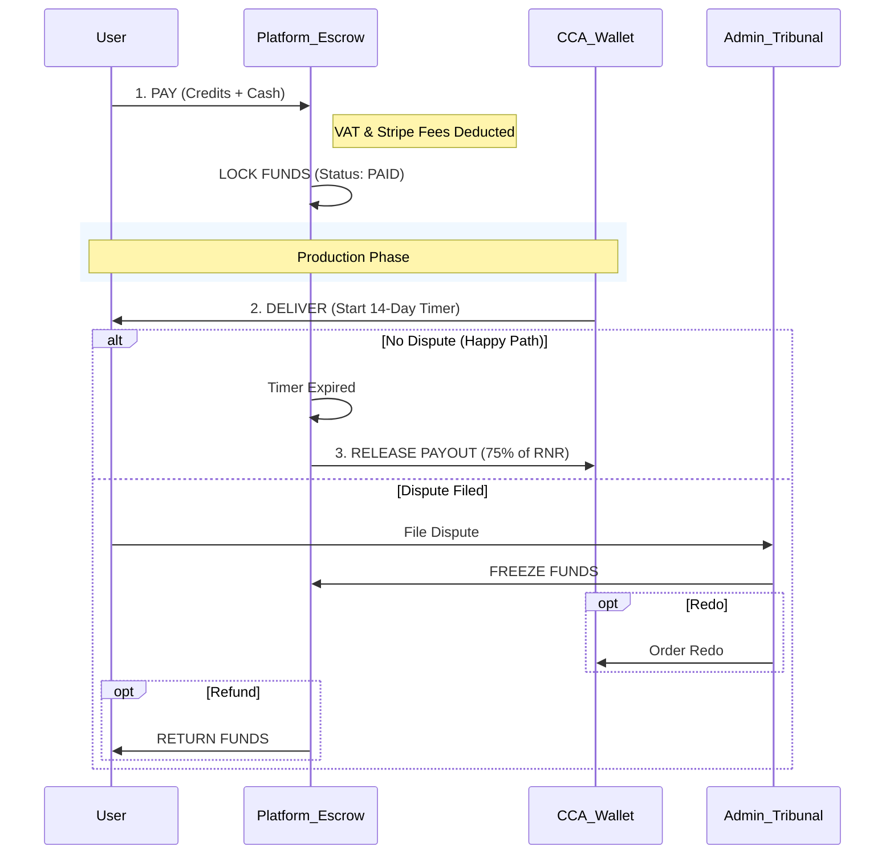

> **Status:** historical — family F13 member; Gemini/Antigravity-era. Kept for provenance; not current. Source: `Visualisatium/planning/old2/Business_Logic_Master_Spec_combined_v1.md`. 

# Business Logic Master Spec: The Constitution of Visualisatium
**Version:** Consolidated 2.1 (Synthetic)
**Date:** 2026-01-21
**Status:** BATTLE-TESTED SPECIFICATION
**Author:** The Planning Gem (CPO) / Synthesized by Organizing Gem

---

## 1. EXECUTIVE SUMMARY & CRITICAL LOGIC PATCH
This document serves as the "Laws of Physics" for the Visualisatium platform. It connects Money, Time, and Permission into a single logical framework.

### 🚨 CRITICAL ALERT: The "Bankruptcy Bug" (Financial Core)
**The Issue:** The `PricingTable` allows users to buy credits at a **40% discount** (1000 credits @ €3,000 = €3.00/credit). The List Price of a Manhour is €75 (or 15 Credits).
* **Scenario:** A user buys the bulk pack (€3.00/credit) and orders 1 Manhour (15 Credits).
* **Realized Revenue:** 15 * €3.00 = **€45.00**.
* **Old Rule:** "CCA gets 75% of invoiced amount." If interpreted as *List Price* (€75), the CCA payout is **€56.25**.
* **Result:** Revenue (€45.00) - Cost (€56.25) = **LOSS of €11.25 per hour.**

**The Fix (Constitution Article 1):**
The "Invoiced Amount" used for CCA Payout calculations must be the **Realized Value** (Net Revenue), not the Nominal List Price.
* **Logic:** The system must track the *Purchase Price* of the specific credits used (FIFO - First In, First Out).
* **Corrected Flow:**
    1. User burns 15 Credits (bought at €3.00).
    2. Taxable Revenue = €45.00.
    3. CCA Payout = 75% of €45.00 = **€33.75**.
    4. Platform Gross Margin = **€11.25** (25%).

---

## 2. AUTOMATION LOGIC (The "Recurring" Engine)
**Context:** Users can subscribe to **Creation Service** (e.g., "Adventures of [Name]").
**Logic:**
*   **Product Type:** "Automated Creation Task" (e.g., Daily Character Adventure).
*   **Trigger:** Daily / Weekly / Monthly Cron (00:00 UTC).
*   **Execution:**
    1.  Check `User_Credit_Balance >= Cost`.
    2.  **IF Pass:** Deduct Credit -> Send Prompt to AI (Route Job to **Default Creator (AI)**) -> Deliver Result -> Notify User that creation is ready.
    3.  **IF Fail:** Pause Subscription -> Send "Low Balance" Email.
*   **Constraint:** These products allow *zero* manual modifications.

## 2. THE AUTOMATION ENGINE ("Daily Creation")
**Source:** v2.0 Refinement & v1.2 Rules

### Rule 2.1: The "Creation Service" Protocol
**Correction:** Users subscribe to a **Creation Service**, not a static feed. These products allow *zero* manual modifications.
1.  **Product Type:** "Automated Creation Task" (e.g., Daily Character Adventure).
2.  **Trigger:** Daily Cron Edge Function runs at 00:00 UTC.
3.  **The "Credit Tank" Check:**
    * Check: `User_Credit_Balance >= Product_Cost`.
    * **IF Pass:**
        * Deduct Credit (FIFO).
        * Route Job to **Default Creator (AI)**.
        * Deliver Result -> Notify User: "Your daily story is ready."
    * **IF Fail:**
        * **Do NOT** process the job.
        * **Status:** `paused_insufficient_funds`.
        * **Notification:** "Daily Story paused. Top up credits to resume." (Send "Low Balance" Email).

---

## 3. FINANCIAL LOGIC & FLOWS

### A. The "Split Invoice" Protocol
Used when User pays partially with Credits and partially with Cash.
1.  **Input:** Total Cart Value €100. User wants to use 10 Credits (Value €50).
2.  **System Action:**
    *   **Invoice A (Virtual):** €50 equivalent. Paid via Credit Ledger. (VAT = 0% on invoice, as VAT was paid at credit purchase).
    *   **Invoice B (Transactional):** €50. Paid via Stripe. (VAT = 25.5% added to this portion).
3.  **Accounting Tagging:**
    *   `Invoice_A` tagged `source: credit_redemption` -> CCA Payout calc uses **FIFO Realized Value** of those credits.
    *   `Invoice_B` tagged `source: stripe` -> CCA Payout calc uses **Net amount** (minus Stripe Fees).

### B. The Payout Logic Flow (Mermaid)

## 3. PRICING & INVOICING RULES
**Source:** "Pricing System.docx" via v2.0 / v1.2

### A. The "Work Starts on Payment" Rule
* **Strict Logic:** No work for final product begins until payment is confirmed.
* **Exception:** The Negotiation Phase (Status: `offer_req`).

### B. The "1-Hour Minimum" (Offer Protocol)
* **Context:** For "Offer based, invoiced Products".
* **Rule:** To ensure initiation of a custom negotiation, the User can pay a **1-Hour Deposit Invoice** (e.g., €75).
* **Purpose:** Covers the CCA's time to analyze requirements and making of offer.
* **Outcome:** Deducted from Final Invoice (if Accepted) or retained as "Analysis Fee" (if Rejected/Ghosted).

### C. The "Success Tax" & Split Invoice Protocol
**Objective:** Calculate *True Net Profit* per transaction to prevent margin erosion.
**Formula:** `Net_Platform_Profit` = `Total_Invoiced` - `VAT` - `Stripe_Fees` - `CCA_Payout` - `Compute_Cost`

**The Mixed-Payment Scenario (Cash + Credits):**
When a user pays €50 via Stripe and 10 Credits (Value €30):
1.  **Invoice A (Cash):** €50. VAT applied (25.5%). Stripe Fees applied.
2.  **Invoice B (Credits):** €30. VAT = 0 (Paid at credit purchase). Stripe Fees = 0.
3.  **CCA Payout:** Calculated on the sum (€80) minus the proportional costs.

---

## 4. THE CONSOLIDATED STATE MACHINE
Includes Validation states, Production states, and Delivery states.

### Phase 1: Negotiation & Commitment
| Status ID | Label | Owner | Trigger Event | System Action | Permission  / Restriction |
| :--- | :--- | :--- | :--- | :--- | :--- |
| `draft` | **Drafting** | User | User selects Product. | Form rendered (`required_data`). | 🟢 User editing. |
| `offer_req` | **Offer Requested and paid for** | User | User has submitted the request and paid for 1st hour. | **1-Hour Deposit Invoice Generated from payment. Shown ad CCA list as ready to take** | 🚫 Actual Work cannot start, buf offer preaparation / generation can. |
| `offer_req_without_pay` | **Offer Requested Without 1-Hour Puchase** | User | User has submitted the request without payment for 1st hour. | **Shown to CCA list as ready to take-at-your-own-risk.** | 🚫 Actual Work cannot start, buf offer preaparation / generation can. |
| `claimable` | **In Queue** | System | 1st hour Payment Confirmed or Offer requested withtout Payment. | Routed to **Marketplace**. | 🔓 Claimable. |
| `claimed` | **In Progress for Offer** | CCA | CCA clicks "Claim". | Job **Soft Locked** to CCA. | 🚫 Locked to CCA. |
| `offer_sent` | **Offer Sent** | CCA | CCA submits offer including price/time/details. | Deposit applied as part payment of total. | 🚫 User can accept, reject of make counter offer editing the one made by CCA. |
| `counter_offer_received` | **Counter Offer Received** | USer | User has submitted counter offer. Waiting for CCA to accept, reject (relates back to original offer as offer_sent) or make new counter offer (relates to new offer and back to state as offer_sent) | Deposit still applied as part payment of total. | 🚫 User can accept, reject of make counter offer editing the one made by CCA. |
| `offer_rejected` | **Offer Rejected** | System | User Rejects Offer. | Both CCA and User Informed. | 🚫 User can restart the prosess by changing to Accpeted or make counter offer. |
| `awaiting_pay` | **Accepted, Invoice Generated by Offer. Awaiting Payment** | System | User accepts Offer. | Final Invoice Generated. Price as mentioned in Offer. | 🚫 Assets locked. |
| `parting_requested`| **User has requested to split payments to certain parts. Invoice generated for each part. ** | System | User has requested to split the payments |  System tries to do it automatically, if fails informs Admin. If successul, returns to state awaiting_pay | 🚫 Assets locked. |
| `partially_pay`| **Partially Paid** | System | User pays Invoice A. | Work Timer starts *only* for paid segment. | ⚠️ Limited scope. |
| `paid` | **Paid** | System | Transaction successful. | **Funds Moved to Escrow.** | ✅ Moves to Queue. |

### Phase 2: Production (The Factory)
| Status ID | Label | Owner | Trigger Event | System Action | Permission |
| :--- | :--- | :--- | :--- | :--- | :--- |
| `in_progress` | **In Progress** | CCA | CCA has started / is processing order. | Job **Locked** to CCA. | 🚫 Locked to CCA. |
| `action_req` | **Action Required** | CCA | CCA flags missing info. | Timer Paused. SLA Stops. When user send missing info, returns to in_progress | ⚠️ User notified. |
| `prod_ready` | **Production Ready** | CCA | CCA uploads assets. | Assets processed (Watermarked). | 🔒 Assets not yet downloadable. |

### Phase 3: Delivery, Quality & Acceptance
| Status ID | Label | Owner | Trigger Event | System Action | Permission |
| :--- | :--- | :--- | :--- | :--- | :--- |
| `delivered` | **Under Review** | User | CCA clicks "Deliver". | **Review Timer Starts (14 Days).**. Watermarked preview. | ⏳ Funds Locked. |
| `disputed` | **Disputed** | Admin | User files Dispute (Day 1-14). | Review Timer Paused. Ticket created. | 🚨 Payout Blocked. |
| `redo_progress`| **Redo in Progress** | CCA | Admin orders "Redo". | Reverts to `in_progress`. | ⚠️ Old assets archived.|
| `refunded` | **Refunded** | System | Admin orders "Refund". | Stripe Refund. CCA gets €0. | 💸 Money returned. |
| `completed` | **Completed** | System | Timer expires OR **Waiver**. | **Payout Release Triggered.** | ✅ Funds Released. |

---

## 1. THE "IRREVERSIBLE ACTION" PROTOCOL (Legal & UX)
**Context:** To shorten the "Review Period" (cash-flow delay), we allow users to "Accept" early. They have knowledge by accepted terms that this will stop their right to refund / dispute. 

### The Trigger Events
1.  **Download High-Res:** User clicks "Download Original".
2.  **Social Share:** User clicks "Share to [Platform]" (publicly publishing the asset).
3.  **"Accept" Button:** User manually clicks "Mark as Complete".

### The Interaction Logic (Modal Spec)
**GIVEN** the order status is `delivered` (In Review)
**WHEN** the user attempts a **Trigger Event**
**THEN:** 
    1.  Status -> `completed`.
    2.  Review Timer -> **0**.
    3.  Funds -> Released to CCA immediately.
    4.  Watermarks -> Removed.
---

## 6. THE ABANDONMENT & RESTORATION PROTOCOL ("Phoenix")

### A. The Sunset Clause (30 Days)
**Trigger:** Order status `offer_sent` or `offer_req` > 30 Days.
**System Action:**
1.  Status -> `archived_abandoned`.
2.  Deposit -> Released to CCA as "Consultation Fee" (Final).

### B. The Phoenix (Restoration) Flow
**User Action:** User views `archived_abandoned` offer -> Clicks **"Revive Request"**.
**System Action:**
1.  Status -> `offer_restored` (New Negotiation).
2.  Data -> Cloned to new Order ID (`is_restored: true`).
3.  CCA Warning: "⚠️ Revived offer. Check pricing validity."