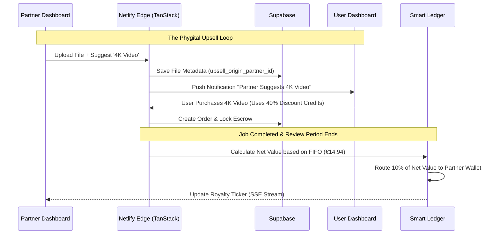

> **Status:** historical — family F4; superseded by `docs/design/dashboards/dashboards-blueprint.md`. Kept for provenance; not current. Source: `Visualisatium/planning/Dashboard/Dashboards_Features_PRD.md`. 

# BATTLE-TESTED SPECIFICATION: DASHBOARD GAMIFICATION & UPSELLS
**Filename:** `specs/Dashboards_Features_PRD.md`

## 1. OBJECTIVE
To implement the "Phygital Upsell Loop" for Partners, the "Saga Storyboard" for Users, and the "Quality Streak" for CCAs to drive revenue, retention, and quality.

## 2. USER STORIES
*   **As a Partner**, I want to suggest AI enhancements when I upload digitized files, so I can earn a 10% royalty if the user buys the enhancement.
*   **As a User**, I want to drag and drop my saved Character DNA into a storyboard before buying a Saga, so I can visualize the final product and build my narrative.
*   **As a CCA**, I want to earn a visual badge and a payout bonus for consecutive 5-star jobs, so I am rewarded for high-quality work, not just speed.

## 3. ACCEPTANCE CRITERIA (GHERKIN)

**Feature 1: Partner Phygital Upsell Loop**
`GIVEN` a Partner is on the "Logistics Signal" board uploading a digitized file
`WHEN` they check "Suggest Enhancement" and select "Standard 4K Video"
`THEN` the system flags the file with `upsell_origin_partner_id`
`AND` sends a push notification to the User
`AND` if the User converts, the Partner Dashboard "Royalty Ticker" increments by 10% of the Net Realized Value.

**Feature 2: User Saga Storyboard (Drag & Drop)**
`GIVEN` the User is viewing a Saga product (e.g., "Love Story Trailer")
`WHEN` they click "Plan Storyboard"
`THEN` a UI canvas opens using `TanStack Store` for state management
`AND` the user can drag their `Asset_DNA` cards from their Vault into "Scene" slots
`AND` the selected DNA payloads are attached to the order upon checkout.

**Feature 3: CCA Quality Streak Multiplier**
`GIVEN` a CCA completes a job and the 14-Day Review Period ends
`WHEN` the User leaves a 5-Star review with no dispute
`THEN` the CCA's `quality_streak_count` increments by 1
`AND` if the count reaches 5, the CCA Dashboard renders a "Flame Badge"
`AND` the next job claimed applies a +5% payout modifier to their Ledger entry.

## 4. TECHNICAL LOGIC (MERMAID)



## 5. MACHINE-READABLE SUMMARY (JSON)

```json
{
  "feature_id": "dashboards_gamification_upsell_v1",
  "complexity": "high",
  "requires_db_migration": true,
  "affected_roles": ["admin", "user", "cca", "partner"],
  "stack_components": [
    "TanStack Start",
    "TanStack Store",
    "Supabase DB (RLS & Triggers)",
    "Netlify Edge",
    "Capacitor Camera API"
  ]
}
```