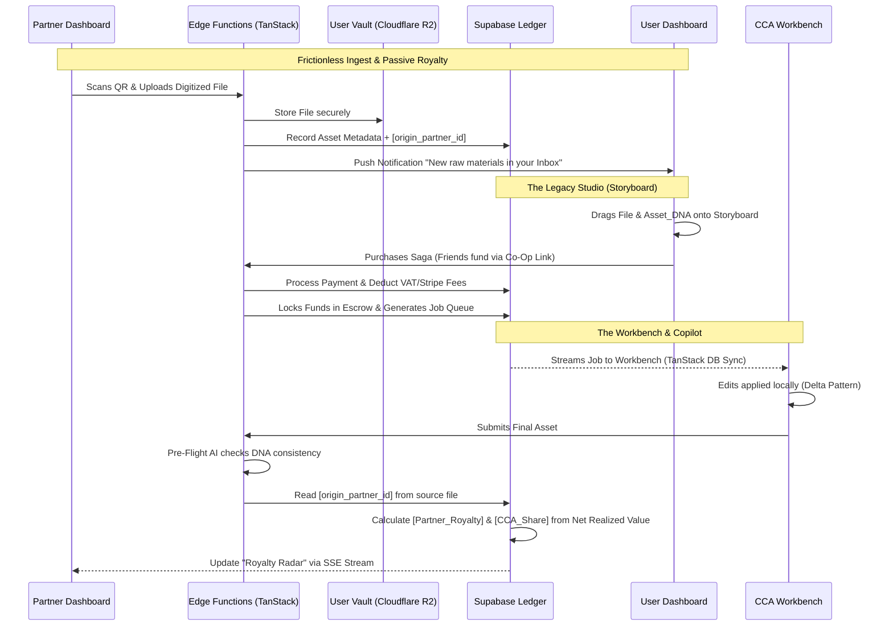

> **Status:** historical — family F4; superseded by `docs/design/dashboards/dashboards-blueprint.md`. Kept for provenance; not current. Source: `Visualisatium/planning/Dashboard/Dashboards_Unified_PRD.md`. 

# BATTLE-TESTED SPECIFICATION: DASHBOARD UX & SYSTEM MECHANICS
**Filename:** `specs/Dashboards_Unified_PRD.md`

## 1. OBJECTIVE
To finalize the behavioral logic and user journeys for the Unified Dashboards, integrating high-density administrative control, high-frequency CCA throughput, gamified User retention, and automated Partner royalty logistics, built strictly on the TanStack/Capacitor stack.

## 2. USER STORIES
*   **As a Partner**, I want to quickly scan a QR code to mark a physical package as received, and securely upload the digitized files so they are tagged to my account for future passive royalties.
*   **As a User**, I want to find my digitized files in an "Unprocessed Inbox" and drag them onto a visual storyboard so I can plan my narrative before spending credits.
*   **As a CCA**, I want the Workbench to suggest a Manhour quote and reward me with a Quality Streak multiplier so my efficiency and accuracy are maximized.
*   **As an Admin**, I want to hover over financial metrics to instantly see the calculated Net Profit (Realized Revenue - Discount - VAT - Fees - Payouts) without manually checking the ledger.

## 3. ACCEPTANCE CRITERIA (GHERKIN)

**Feature 1: Partner Passive Royalty Engine**
`GIVEN` a Partner uses the Capacitor QR Scanner to receive a physical package
`WHEN` the Partner digitizes and uses the "Ingest Bridge" to upload the resulting file
`THEN` the system saves the file to the User's Cloudflare R2 Vault (Unprocessed Inbox)
`AND` silently applies the Partner's `origin_partner_id` to the file metadata
`AND` WHEN the User purchases any product using that file
`THEN` the Smart Ledger calculates the Net Realized Value and applies the `[Partner_Split]` variable from the Pricing Sheet to the Partner's wallet.

**Feature 2: The User Saga Canvas & Curator Co-Op**
`GIVEN` the User is in the "Legacy Studio" Dashboard
`WHEN` they open a "Collection" or "Saga" product template
`THEN` the UI renders a node-based visual tree (`Motion for React`)
`AND` the user can drag items from their R2 Vault into the "Source Material" nodes
`AND` IF they lack sufficient credits, they can generate a `Contribute_Link`
`THEN` external family members can fund the project directly into the User's locked Escrow.

**Feature 3: CCA Workbench "Smart Copilot" & Pre-Flight Check**
`GIVEN` a CCA opens a "Waiting Offer" job in the Workbench
`WHEN` the system detects 50 attached images and requests a "Video Saga"
`THEN` the Smart Copilot evaluates historical database averages and `Lists` complexity
`AND` injects a "Draft Quote" (e.g., `[Calculated_Manhours]`) into the CCA's input field for review.
`AND` WHEN the CCA attempts to submit the final asset
`THEN` the Pre-Flight Guard verifies the asset against the User's `Asset_DNA` triggers, warning the CCA if core stylistic elements are missing.

**Feature 4: Admin Success Tax & Fraud Canary**
`GIVEN` the Admin views the Financial Pulse dashboard
`WHEN` a job is completed
`THEN` the Success Tax Visualizer displays the margin breakdown (FIFO Realized Revenue minus dynamic variables: VAT, Gateway, CCA Share, Partner Share)
`AND` IF a User triggers a specific product (e.g., Re-Roll) beyond the velocity threshold
`THEN` the GPU Fraud Canary halts the User's generation capability and flags the account for Admin review.

## 4. TECHNICAL LOGIC (MERMAID)



## 5. MACHINE-READABLE SUMMARY (JSON)

```json
{
  "feature_id": "vivid_unified_dashboards_master",
  "complexity": "extreme",
  "requires_db_migration": true,
  "affected_roles": ["admin", "user", "cca", "partner"],
  "stack_components": [
    "TanStack Start",
    "TanStack Store",
    "Motion for React",
    "Cloudflare R2",
    "Ionic Capacitor",
    "Supabase",
    "Apache Iceberg"
  ],
  "variable_dependencies": [
    "PricingTable Sheet (Manhours, Credits, Discounts)",
    "pricing-plan-vivid Sheet (Partner Splits, Fixed Prices)"
  ]
}
```