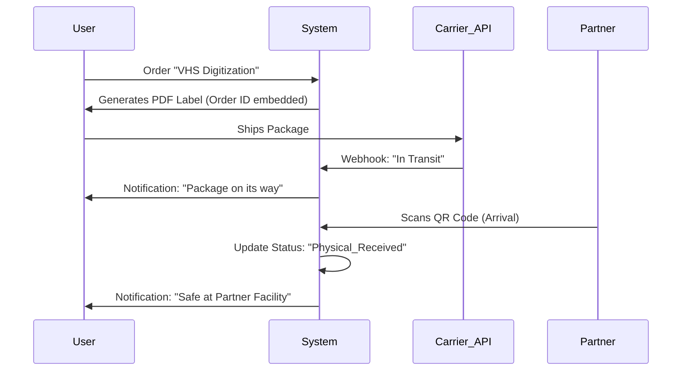

> **Status:** historical — Gemini-era planning material, superseded as a layer by the Feb-2026 master series. Kept for provenance; not current. Source: `Visualisatium/planning/specs/old2/Feature_Pack_Trust_Continuity.md`. 

# PRODUCT REQUIREMENT DOCUMENT: TRUST & CONTINUITY PACK (v1.0)
**Author:** Planning Gem (CPO)
**Status:** DRAFT
**Scope:** 5 Core Features for Platform Trust, Logistics, and Asset Consistency.

---

## 1. THE "CHAIN OF CUSTODY" (Physical Logistics)
**Objective:** Track physical items (photos, VHS) sent by users to partners for digitization.

### User Stories
* **As a User**, I want to download a shipping label with a unique QR code so that my package is linked to my digital order.
* **As a User**, I want to receive a notification when the Partner physically scans my package so I know it didn't get lost in the mail.
* **As a Partner**, I want a "Logistics View" to scan incoming QR codes and update statuses to "Received" instantly.

### Technical Logic (Mermaid)

