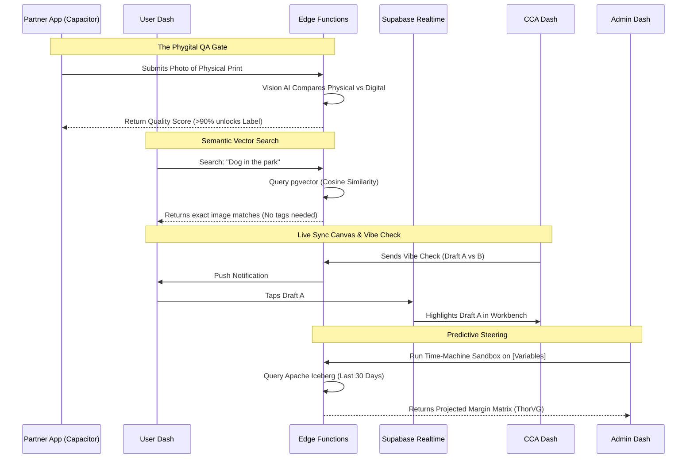

> **Status:** canonical dashboards **strategic layer** (ruling Q2, 2026-04-19, newest in the corpus). The specification detail it assumes is in `dashboards-blueprint.md`. Paths under `specs/` cited in the body do not exist (inventory, referenced-but-absent). Source: `Visualisatium/planning/Dashboard/Dashboards_Ultimate_Mechanics_PRD.md`. 

# BATTLE-TESTED SPECIFICATION: ULTIMATE DASHBOARD MECHANICS
**Filename:** `specs/Dashboards_Ultimate_Mechanics_PRD.md`

## 1. OBJECTIVE
To deploy the final synthesis of the VIVID Dashboards, executing predictive margin modeling, zero-click AI upsells, real-time CCA/User collaboration, Semantic Search, and robust B2B Partner networking.

## 2. ACCEPTANCE CRITERIA (GHERKIN)

**Feature 1: CCA "Vibe Check" Micro-Interaction**
`GIVEN` a CCA is working in the Active Workbench
`WHEN` they select two generated drafts and click "Send Vibe Check"
`THEN` the User receives a mobile push notification with both images
`AND` WHEN the User taps option "A"
`THEN` the CCA's Workbench receives a `Supabase Realtime` event highlighting "A"
`AND` the interaction is permanently logged in the Order History without requiring a chat thread.

**Feature 2: Partner Vision AI Quality Gate**
`GIVEN` a Partner is preparing to ship a physical product
`WHEN` they click "Generate Shipping Label"
`THEN` the Capacitor app opens the native camera and requires a photo of the physical item
`AND` the Edge Function streams the photo and the original digital file to a Vision AI model
`AND` IF the AI Adherence Score is > 90%
`THEN` the Carrier Webhook fires and generates the printable shipping label.

**Feature 3: User Semantic Memory Search**
`GIVEN` a User has hundreds of untagged files in their Unprocessed Inbox
`WHEN` they type "Snowy day in Vantaa" into the global search bar
`THEN` the system queries the `pgvector` database for cosine similarity
`AND` instantly returns all images containing snow and matching geographic metadata, ignoring file names entirely.

**Feature 4: Admin Time-Machine Sandbox**
`GIVEN` the Admin accesses the Financial Simulator
`WHEN` the Admin alters the `[Credit_Discount_Percentage]` variable
`THEN` the system triggers an `Apache Iceberg` historical query
`AND` recalculates the Success Tax across the last 30 days of transactions
`AND` renders a ThorVG heatmap showing the hypothetical impact on Platform Net Profit.

## 3. TECHNICAL LOGIC (MERMAID)



## 4. MACHINE-READABLE SUMMARY (JSON)

```json
{
  "feature_id": "vivid_dashboards_god_tier_synthesis",
  "complexity": "god-tier",
  "requires_db_migration": true,
  "affected_roles": ["admin", "user", "cca", "partner"],
  "stack_components": [
    "pgvector (Supabase Vector Search)",
    "TanStack AI SDK (Vision & Policy LLMs)",
    "Capacitor Camera API (QA Gate)",
    "Supabase Realtime (Live Sync/Vibe Check)",
    "Apache Iceberg (Time-Machine Simulator)",
    "Netlify Edge (Magic Wand Automation)"
  ],
  "variable_dependencies": [
    "PricingTable Sheet (Dynamically fetched variables)",
    "pricing-plan-vivid Sheet (Partner_Royalty, Micro_Credit_Cost)"
  ]
}
```